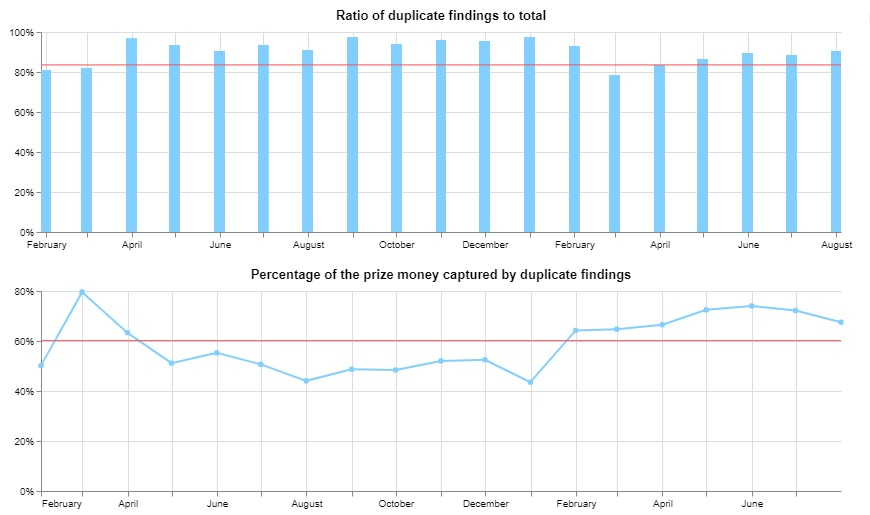
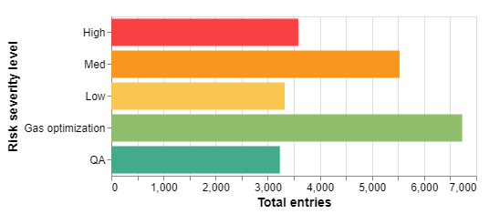
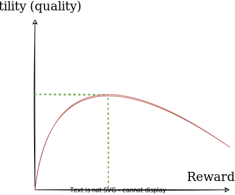
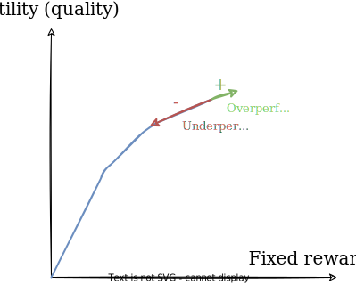
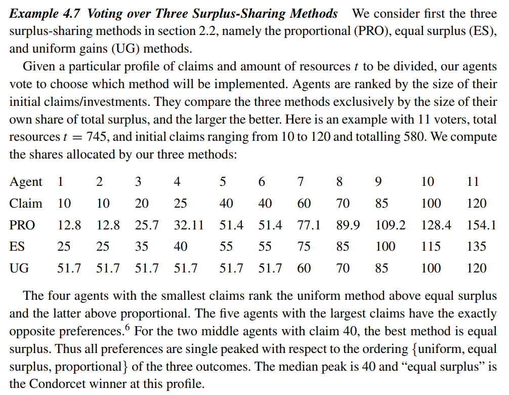

# DAO Security (DAOS)
## Table of contents
- [General principles](#general-principles)
- [Review of existing solutions](#review-of-existing-solutions)
  * [Bug bounties](#bug-bounties)
  * [Code4rena](#code4rena)
  * [EOS players](#eos-players)
- [Related metrics for context](#related-metrics-for-context)
  * [EOS](#eos)
  * [WAX](#wax)
  * [ETH](#eth)
- [Design and architecture discussion](#design-and-architecture-discussion)
  * [Overview](#overview)
  * [Audit process](#audit-process)
    + [Flow summary](#flow-summary)
  * [Governance systems](#governance-systems)
    + [Bipartite system (operators/community)](#bipartite-system--operators-community-)
    + [Tripartite system (operators/judges/community)](#tripartite-system--operators-judges-community-)
    + [Eliminating operators](#eliminating-operators)
    + [Additional considerations](#additional-considerations)
  * [Reward systems](#reward-systems)
    + [Assessing the quality of submissions](#assessing-the-quality-of-submissions)
    + [Duplicate findings](#duplicate-findings)
    + [Mathematical approach for the distribution of rewards](#mathematical-approach-for-the-distribution-of-rewards)
      - [Using a utility function](#using-a-utility-function)
      - [Voting over reward sharing methods](#voting-over-reward-sharing-methods)
      - [wip](#wip)
  * [Security aspect](#security-aspect)
- [Technical considerations](#technical-considerations)
  * [Github as a supporting platform](#github-as-a-supporting-platform)
  * [Pomelo integration](#pomelo-integration)
- [References](#references)

## General principles
The DAO Security (DAOS) project aims to assist EOS developers in reviewing the security aspect of their project. 

Instead of a traditional security firm private audit, the open nature of the [audit process](#audit-process) allows for better opportunities to discover bugs, vulnerabilites and optimizations. 

Auditors will be incentivized by the possibilities of growing their skills and being rewarded for working on different projects, while developers will receive a lot more work and insights (thanks to the varied skillset of each individual auditors) than they may get from a traditional audit.

*Who would benefit from it ?*
- **EOS developers** getting relieved of the need to review the code themselves and get better insights into how to build secure applications.
- **Auditors** for getting a chance to contribute efforts on collaborative community audit request and receive financial compensation.
- **Users** for feeling much safer in investing funds or simply interacting with apps in the space.

*What are their requirements ?*
- **EOS developers** (*cost-effectiveness, support, value through skilled auditors*)
- **Auditors** (*worthy of time, non-toxic environnement, sense of community, scaling to skill level*)
- **Users** (*transparency, provable work, possibility of rewarding auditors?*)

## Review of existing solutions
*A very good blog post explaining the differences between smart contract auditing approaches: https://thecryptospace.substack.com/p/audit-audit*

### Bug bounties
Like in web2, bug bounties platforms have emerged for Web3 projects ([Immunefi](https://immunefi.com/), [Hacken Proof](https://hackenproof.com/programs), etc.) that work directly with developers to provide a structure (terms, scope, etc.) for auditors to submit and get rewarded for their findings.

- [+] Well-suited for existing projects wishing to streamline their vulnerability disclosure process.
- [+] Can attract high-profile auditors if rewards are high enough (Immunefi proposes up to millions of $ for critical vulnerabilties in high-profile projects).
- [+] Better control over the disclosure / private communication of vulnerabilites (?)
- [-] Less reliable in terms of work done (no deadline, submissions timing is pretty much random, thorough review not guaranteed).
- [-] Less visibility as your bug bounty program gets listed with tons of others (with potentially higher rewards) for auditors to choose from.

### Code4rena
[Code4rena](https://code4rena.com) offers "community-driven contests for smart contracts audits" (taken from the [docs](https://docs.code4rena.com/)). As a unique project in the security audit domain, it serves as a base and reference for some of the ideas presented in this document.

**Sponsors** first contacts the core team for specifying their need for a codebase security audit of their project. After working out the details (like the prize pot size), the team sets up a time window of several days (usually between 3 and 7) for auditors (called **wardens**) to submit their findings. These findings are classified as either medium or high severity or bundled in one Quality Assurance (QA) report (also containing gas optimizations for Ethereum-based projects).

At the end of the contest, the submissions are closed and the contest enters into the judging phase where a **judge** (rarely more than one) will be appointed for evaluating the validity and quality of the findings. For all findings, they will flag duplicates that multiple wardens may have reported as they have no way of knowing if the vulnerability they've found hasn't also be found by others. 

For high and medium severity findings, judges need to assess if the risk is present (high ~= immediate loss of funds, medium ~= potential risk see [Judging criteria](https://docs.code4rena.com/awarding/judging-criteria)) and have the ability to downgrade (or sometime upgrade) a finding based on their judgment. Wardens will then be compensated according to a exponential decay formula taking into account the risk and amount of auditors who found the same vulnerability (see [Incentive model and awards](https://docs.code4rena.com/awarding/incentive-model-and-awards)).

For QA reports, the judge assign a score (between 1-100) based on the quality of the report and auditors will be compensated according to the score of their report using a curve-based mechanism. The top scoring report will also be featured on the final audit publication.

It's worth noting that Code4rena allow for wardens to form **teams** and sends their findings under one common name. Rewards will be attributed to that particular team who can then split it however it wants between its members. Teams must be created and approved by the Code4rena staff prior to the start of a contest.

Also see the docs for [Bug bounties vs audit contests](https://docs.code4rena.com/#bug-bounties-vs-c4-audit-contests), [Traditional audits vs audit contests](https://docs.code4rena.com/#traditional-audits-vs-c4-audit-contests) and feel free to explore to learn more about their processes.

From my own experience with the audit process (having participated as an auditor in the [Golom contest](https://code4rena.com/contests/2022-07-golom-contest)):
- [+] The competition aspect acts as a motivation boost for finding critical vulnerabilites and wanting to "top the charts".
- [-] The documentation and code comments requirements before auditing are quite low and can lead to confusion when auditing (somehow counterbalanced with the rapid response of the project's developers but this not always the case).
- [-] Looong audit process delay (usually more than a month after the contest ended) as judges works with developers to process all the findings (even longer for the reward delivery). This makes it hard for auditors to rely on the platform for consistent earnings.
- [-] Low transparency and lack of information during the judging process (one of Code4rena's main improvement goal).
- [-] Reliant on the Github platforms for submitting, storing and processing findings (*security implications? decentralization?*).

### EOS players
- [Certik](https://www.certik.com/products/security-audit): « A comprehensive security assessment of your smart contract and blockchain code to identify vulnerabilities and recommend ways to fix them. »
- [SlowMist](https://www.slowmist.com/): « Focusing on Blockchain Ecosystem Security
In security, slow is better, better will be more fast »
- [Sentnl](https://sentnl.io/): « Blockchain Security Audits »
- [EOS42](https://eos42.io/services/audit): « EOSIO Smart Contract Audits »
- [ImmuneBytes](https://immunebytes.com/): « A Smart Contract Auditing Solution »
- [EosAuditor](https://eosauditor.com/): smart contracts security audits (*doesn't seem very professional*)
- [Hacken](https://hacken.io/): « We make web3 a safer place »
- [Klevoya](https://klevoya.com/): used to provide audit services now acquired by Immunefi
- [Audit+](https://eosnetwork.com/blog/audit-blue-paper/): « Providing an overall framework for security analysis tooling and contract audit for EOSIO-based applications » (*very insightful, also this project could align with goal #1 and #5 of [blue paper](https://drive.google.com/file/d/1hQsN-_4DN5Lj9iDih0N41r8-ZeEpFRlr/view)*)

## Related metrics for context
### EOS
| Metric | Value |
| ------ | ----- |
| Numbers of projects [[1]](#user-content-#1) | ~500 |
| Users [[1]](#user-content-#1) | ~425k for the top 25 projects (~500 for Pomelo) |
| Type of projects [[1]](#user-content-#1) | Slightly more Gaming, DeFi, Exchanges |
| Open-source repos [[3]](#user-content-#3) | 670 repos on Github with tag EOS |
| Total EOS [[2]](#user-content-#2) | 1,065,284,439 |
| Staked EOS [[2]](#user-content-#2) | 354,476,937 |
| Circulating EOS [[2]](#user-content-#2) | 710,807,502 |
| Staked to circulation ratio [[2]](#user-content-#2) | 50% |
| Number of smart contracts (15 Nov. 2019) [[7]](#user-content-#7) | ~55,000 |
| Number of recorded attacks on smart contracts (2018-2019) [[6]](#user-content-#6) | 113 |

### WAX
| Metric | Value |
| ------ | ----- |
| Numbers of projects [[1]](#user-content-#1) | ~225 |
| Users [[1]](#user-content-#1) | 1.5M+ for the top 25 projects |
| Type of projects [[1]](#user-content-#1) | Almost exclusively Gaming, some Exchanges and miscs |
| Open-source repos [[3]](#user-content-#3) | 50 repos on Github with tag WAX |
| Total WAX [[2]](#user-content-#2) | 3,931,361,230 |
| Staked WAX [[2]](#user-content-#2) | 1,670,258,769 |
| Circulating WAX [[2]](#user-content-#2) | 2,261,102,460 |
| Staked to circulation ratio [[2]](#user-content-#2) | 74% |

### ETH
| Metric | Value |
| ------ | ----- |
| Numbers of projects [[1]](#user-content-#1) | ~3500 |
| Users [[1]](#user-content-#1) | ~400k for the top 25 projects |
| Type of projects [[1]](#user-content-#1) | Marketplace, DeFi, Exchanges, miscs  |
| Open-source repos [[3]](#user-content-#3) | 15k+ repos on Github with tag ETHEREUM |
| Total ETH [[4]](#user-content-#4) | 122,370,574 |
| Staked ETH [[5]](#user-content-#5) | 14,441,062 |
| Circulating ETH [[4]](#user-content-#4) | 122,370,574 |
| Staked to circulation ratio | 12% |
| Number of smart contracts (15 Nov. 2019) [[10]](#user-content-#10) | ~20M |
| Number of recorded attacks on smart contracts (Q1-Q2 2022) [[8]](#user-content-#8) [[9]](#user-content-#9) | 113 |

## Design and architecture discussion
As a foreword to the design and architecture of a DAO-like system, it should be noted that such an organization requires quite a few individuals to run efficiently and in a way that the *decentralized* nature of the system would not be compromised.

~~As such, it would be best to first assess if the EOS ecosystem is capable of supporting a security-focused community of developers and auditors before launching any big project towards the creation of a DAO.~~ (*don't worry about this part*)

The goals and mode of operation of the DAO should also be aligned with the needs of day-to-day EOS developers. Developers and their projects comes first with the DAO helping them grow secure and resilient products through code audits.

Since there isn't currently anything like it in the space, this project could also be the spark needed for bringing auditors and raising awareness about the security of on-chain EOS contracts.

### Overview
One thing that started to become very apparent after the first discussions with the team is that **the DAOS project is all about communication**. DAOS acts as the intermediary between *clients* and *auditors* (also known as *the community*).

Clients should not expect DAOS to write code for them, fix infrastructure issues, run pentesting or anything like that. They communicate their need for an audit of a codebase and receive a detailed report highlighting the potential issues found by the community.

Auditors receive the code and start working **on their own**, communicating any findings to the DAO as part of the auditing process. In exchange, they get a reward based on their contribution effort to the overall audit. They should not expect anything else but transparency and communication from the DAO. In particular, no specific training, equipement or tools will be provided although how-to resources and beginner-friendly behavior are to be expected.

### Audit process
Code audit definition: *A software code audit is a comprehensive analysis of source code in a programming project with the intent of discovering bugs, security breaches or violations of programming conventions.* ([Wikipedia contributors. (2021, May 23). Code audit. Wikipedia. Retrieved September 19, 2022](https://en.wikipedia.org/wiki/Code_audit))

The purpose of auditing a smart contract is to eliminate as much as possible the risks of exploits and unexpected behavior that can occur from errors or overlooked issues in the code. The journey of translating a promising idea into code that runs on a public blockchain can be tedious with lots of pitfalls that developers and newcomers may not be aware of. That's why having a dozen or more pair of eyes look through every aspect of the code is useful for making dapps a safer place for users.

Clients are the ones who defines the **scope** of the audit by providing as much resources as they want (code, documentation, etc.). The DAO will be responsible for assessing the feasibility of the audit according to its own resources (available people, time, other audits, etc.). Clients are expected to supply a sufficient amount of context and documentation for the codebase they want to be audited. They also provide the funds in advance who shall be putted in escrow until the audit is finished and from which the rewards will be taken for the participating auditors.

Auditors will be provided the material, *potential reward amount?* and a **deadline** for which they have to send in all their work. They are aware of the **rules** (*WIP to be defined / accepted on join, audit start or submission?*) regarding audit submissions and the internal workings of the DAO (reward attribution, etc.). A communication channel (*direct? through DAO?*) shall be at the disposition of auditors for reaching the clients regarding any clarifications they may seek in order to perform the audit work.

After the deadline is passed, no other submissions can be sent and the judging process starts (see [Governance systems](#governance-systems) and [Assessing the quality of submissions](#assessing-the-quality-of-submissions) for an overview of possible methods). The main goal is to reward the best performing auditors by granting them a larger share of the audit funds. Once all the findings have been validated (or invalidated for some) and a reward distribution has been acted, the funds are released from the escrow. DAOS gets a share of the prize pool and uses it to reward the active members who will setup the next audit. An audit report, compilation of all the relevant findings, is also posted to the public at the end.

#### Flow summary

\[*Draft flow based on Denis' feedback*\]
1. Project/Protocol/Team needs an audit.
2. It submits a request to DAOS operators who can assess if the request satisfies some minimal audit requirements (documentation, etc.).
3. DAOS operators initiates a Security Audit bounty request to its community. The duration of the bounty can be variable depending on the estimated amount of work required and/or community members availability and/or other factors. 
4. DAOS community accepts or rejects (*explicitly?*) the audit work.
5. DAOS operators rate contributions of effort per community member.
6. DAOS releases audit findings to project/team.
7. Project/Team approves or disapproves (*how to solve conflict ?*) DAOS' audit work
8. Funds released to DAOS community based on their contribution efforts.
9. DAOS releases a final audit report to the public (hosted on IPFS, *with permission?*).

### Governance systems
~~Auditors will probably want a say in how the rewards are distributed, how long the audit should take, what's an acceptable submission, etc.~~

A few possible systems for running the DAO are presented below.

#### Bipartite system (operators/community)
The DAO would be run by a set of **operators** that will be tasked to assess and submit audit requests to the community. They will also be responsible for evaluating the effort provided by community members on an audit as well as release funds and compile a final report to the public.

Initially, the founders of the DAO would act as the de-facto trusted operators. These are people who have the vision for the project and who are willing to put the best effort for running and growing the DAO's operations. In the future, active and well-established members of the community could be able to apply for working as an operator (*community vote?*). 

The rest of the DAO community are the auditors participating in the audit bounty. Anyone would be able to join the effort. A "contribution score" could be used to track members contribution over time (*some privileges?*, *blacklisting some toxic contributors?*).

#### Tripartite system (operators/judges/community)
In the tripartite system, **operators** acts the same way as in the bipartite system except for the part that they no longer evaluate directly the submissions of auditors.

Instead, similar to [Code4rena](#code4rena)'s approach, we separate the operational process of running the DAO and the judging of contests' submissions. **Judges** are the ones that are tasked with determining the individual effort provided by each auditor for a specific audit. They are highly-skilled members of the community (although they can't participate in *any?* audits themselves) who will use their background, judgement and knowledge of the rules (*judging rules used as a reference for judges*) to perform this task.

Judges would be ultimately appointed by operators with the community and other judges being able to recommend people they think would be a great fit. In any case, judges will require to justify from a certain level of experience and audit performance in the DAO (*passing test required?*) prior to being recruited.

#### Eliminating operators
In theory, it would be possible to remove the operator's role entierly:
- Pipelining and automating the whole process from the client's audit proposal to the final report compilation from the auditor's submissions.
- Using smart contracts for the storage, distribution and sending of audit rewards.
- Automating the communication channels setup with eventuals human-support roles for complex interactions.

Decisions requiring judgment such as resolving conflicts or approving a client's audit proposal would be submitted to the community for approval. A reputation-based system would be best suited for weighing each individual opinion that would ultimately decide on the outcome of the decision (see [[11]](#user-content-#11) and [[12]](#user-content-#12)).

The process of eliminating operators from the system could be the long-term goal of the DAO governance, ensuring that community members working for the best of the organization would be the one that have the most influence on the decisions taken (which should be the case for operators but there is a higher risk of collusion with such a small group of people).

*WIP investigate decentralized arbitration service [Kleros](https://kleros.io/)*

#### Additional considerations
According to Vitalik Buterin [[13]](#user-content-#13), one of the main components that differentiates a **D**ecentralized **A**utonomous **O**rganisation (DAO) from just a **D**ecentralized **A**pplication (DA) is *internal capital*. For DAOS, that would be the treasury used to reward auditors (and potentially others) for their work. Hence, mechanisms (such as multi-sig and more) need to be put in place for ensuring the safety and integrity of this internal capital or else the entire DAO structure would be at risk.

The word *Autonomous* is also a key part that caracterize a DAO as opposed to a simpler **D**ecentralized **O**rganisation (DO). There need to be some part of the system that is not prone to human decisions only, running the risk of collusion or malicious exploits of the DAO structure. Rules are one way of enforcing more autonomous evaluations, with invalid or fraudulent submissions/reports exposed to being flagged and rejected (either automatically or manually).

Vitalik also doubles down on the *decentralization* aspect in [[18]](#user-content-#18), challenging the belief that, over time, decentralized organisations will tend to be closer and closer to the structure of a traditional corporation (CEO, board of directors, etc.) for the sake of efficiency. It's interesting to note that one of his argument (*"Centralization is convex, decentralization is concave"*) resembles in many aspect the mathematical solutions to voting-based games described in [[17]](#user-content-#17). 

Indeed, Hervé Moulin proves that when voters presents a *single-peaked preference* when facing multiple choices, the majority voting will always be successful **and** *strategy-proof* meaning that no voter (or group of voters) has an incentive to lie about its peak preference. This is not the case when dealing with scoring methods asking voters to rank candidates (or outcomes) for attributing a score based on the ranking (with the highest scoring choice being chosen). 

What that means for DAOS is that governance decisions should aim to be concave decisions:
- If the outcomes can be arranged in a natural order (like length of time for running a contest), have them being ranked or at least pick a "best choice" from a voter's perspective. Falling into the category of *single-peak preference*, the **mean** of these choices would be considered the majority choice.
- Else if voters can't select a "best choice", use the configuration of *intermediate preferences* (4.5 in [[17]](#user-content-#17)) for ordering the voters instead of the outcomes. The order follows the property that *whenever two agents i, j agree to prefer outcome a to b, so do all agents “between” i and j*. The median agent would then be considered the majority's opinion.

~~The system should allow for an (*active?*) auditor to raise questions of interest to the community and/or make voting proposals.~~

### Reward systems
One of the hardest part of setting up a DAO structure for conducting security audits is the attribution of rewards based on the individual efforts of each community member towards a particular audit. In a traditional audit firm, salaries (and potentially bonuses) are what incentivize auditors to perform to the best of their ability.

With people coming in-and-out of the audit process, from various backgrounds, skill levels and with different abilities to communicate effectively, another system must be put in place that shall be fair and rewarding for all these people.

#### Assessing the quality of submissions
Ultimately, the reward system for compensating the community's work would be based on assessing the **validity** (as in reproducible, attestable, real) and the **quality** (as in documented, testable, well-described) of submissions. Several methods can be explored for achieving this task:

- *Self judging*: auditors will be tasked to rate their peers' submissions (*possibly their own?*) on a reference scale. Algorithms (such as the ones presented on the [Spliddit](http://www.spliddit.org/) website) could then be used to adjust the scores that would later on decide on the rewards attributed. Note that this system is the **least scalable** of all.
- *Fully automated judging*: given a submission as input, a program will analyze the text and metadata to extract informations that, based on his knowledge of rules and best practices (length, language used, presence of Proof-Of-Concept code, etc.), will be used to attribute a validity result and a quality score. This method is the **most susceptible to exploits and "drama"** towards contributions' evaluations.
- *External expert judging*: using well-versed, recognized experts in the auditing field for judging the quality of auditors' submissions is one way of ensuring a fair distribution of rewards.
- *Hybrid approach*: by combining some of the afformentioned approaches, it's possible to imagine a system where the easiest and repetitive tasks (such as flagging duplicate submissions) would be processed automatically or, at least, triaged. Human-judging would then be focused on validating and estimating the criticity and quality of the findings.

In any case, the client would also be involved in this process being able to recognize potential failures or missed vulnerabilites within its own product. Although for the same reasons, the client might not be enclined to acknowledge these findings since the report will be open to the public afterwards (self-esteem, pride, etc.). Hence, the final decision concerning the classification of a submission should be taken by the people responsible from the DAOS's side of things.

*What are we measuring exactly ?*

The judging process being mostly subjective, in case be useful to offer some general direction and references for assisting judges in their assessments. Objective metrics can be effective for a quick first sort of submissions' quality. But finding good metrics for measuring work effort can be tricky. A few options are presented here (based on [[14]](#user-content-#14)): 
- Resources spent: time, reports length and details
- Attributable results: number of valid findings, criticity, CPU/RAM gains from optimization (for EOS smart contracts)

#### Duplicate findings
Due to the nature of the decentralized process, it's natural that some submissions will overlap between auditors (called duplicates findings). These types of submissions are worthless and needs to be eliminated as much as possible: a duplicate finding gives less value to the auditors who found it as they will have to split the reward between them (or not if all is given to the first one, discussed below) **and** it also gives less value to clients as they lose on resources (time/money) that could be spent to find other vulnerabilities.

Although it's normal and pretty common to have duplicates, if we suppose that auditors don't communicate with each other, it's important to keep the ratio to a minimum. The crucial point should be to allocate as much money as possible towards **unique** findings. Duplicates (especially low quality ones) are just eating money out of the prize pool.

Below is a chart showing what's happening to [Code4rena](#code4rena) in the last few months as more and more people are joining. A bulk of the submissions are coming from newcomers submitting low-level findings that accounts for a larger and larger proportion of the prize pool. Even though they reduced the ratio of duplicate findings (they require that all low-level findings be submitted as a **unique** report), the sheer number of them just tears through the prize money allocation (around ~70% to duplicates in the last 6 months although that also includes higher quality findings).

*Duplicate findings stats extracted from Code4rena*

*Findings distribution chart ranked by severity extracted from Code4rena (highest to lowest, top-bottom)*

To solve this, three possible approaches can be considered for dealing with a duplicate finding:
1. The reward is splitted equally among the auditors who found it (Code4rena's approach). This implies a simpler process as auditors don't have to be aware of what others have found and simply hope that they're sending unique findings.
2. The reward is proportionnaly divided according to the timing of the submission (first one to report gets more and so on). This adds a time pressure to auditors which can have a negative effect (also depending on the individuals) in terms of quality of the submissions. Auditors might rush for sending submissions first and not take the time to provide sufficient details.
3. The full reward is given to the first auditor who finds it and duplicates gets no reward at all. This requires the process to be open (see below) as it would be unfair for auditors to spend their time on a vulnerabilty, only for it to not be awarded.

It should be noted that the first two methods incentivize auditors to not disclose their findings during an audit as it would significantly impact their share of the rewards. It also makes them aim for unique (and thus of a higher criticity level) findings.

For all these cases, the process could be considered closed (meaning auditors don't know who sent what and at what time) or open. A closed process makes sense for the first option as the auditors don't need to care about what others are sending in an equal distribution system. However, it would significantly impacts the other two options as auditor wont be able to choose how to reallocate their time if they don't have the information that someone else found what their working on first (and it would even be unfair in the case of 3.). An open process would allow that flexibility at the cost of additional pressure and/or time spending in looking for the latest advances in the audit.  

#### Mathematical approach for the distribution of rewards
The litterature has been quite prolific since the 1940's towards creating and solving *fair division [[15]](#user-content-#15)* problems using game theory models. Of particular interest to the DAOS project is the subject of *fair division of a single homogeneous resource [[16]](#user-content-#16)* (where only the amount matters... like money!), the concepts of *welfarism*, *social welfare orderings* and "*the problem of the commons*" among others [[17]](#user-content-#17). They offer great insights towards creating a fair reward distribution system in the context of subjective evaluations.

*Formulating the problem*

Given a **set** of contributions (described with their own *criticity level*, *properties* – like length and details – and *subjective quality*) for each participants, how can the **common resource** (money) be allocated in a fair way, rewarding the **maximum utility** (quality) as perceived by the client ?

A few possibilities are exposed in more details below.

##### Using a utility function
The main goal would be to shape a concave *utility function* with money as input and the utility (quality of report) as output for each auditor. That way, rewards could be distributed according to the peak utility of each individual.

The greater reward an auditor receives, the more efforts are going to be put in producing high quality submissions **up until a certain point**. Indeed, too much rewards will incentivize the production of *more* reports (hence less effort on each of them) and an overall **decrease** in the utility (quality) of submissions.

The design of this utility function would be rather complex as it needs to take a lot of parameters into account (similar to the ones used for judging submissions) and most notably the **reward incentive** for each particular auditor. Data could be aggregated from past submissions if a "quality score" is provided and a correlation between this "quality score" and rewards could serve as the basis for such a utility function.

Using this method could also allow for a "salary-like" approach for rewarding auditors: by giving them a fixed reward for each contest, auditors can be expected to deliver the maximum utility as described by the curve. To draw the curve, a rate based on the auditor seniority (time spent on audits) and performance would be applied and increase the fixed amount for every audit. Correlating this with the quality delivered in the end allows for finding the single-peak in the utility function (*proof?*). These peaks will then be used to distribute rewards accordingly. As there is only so much prize money available, the goal is to get the closest to it as possible for each auditor.

However, using a curved shape utility function would also imply potentially giving more reward to an auditor for a lower quality work (right-side of the peak). This obviously gives less value for the client. A possible solution would be to adjust the fixed amount depending on the performance of the auditor for an audit (move the given amount to the left/right if under/overperforming, see chart below). This solution stills satisfies the single-peak preference requirement while also preventing spending more reward on lesser quality work. 

A major inconvenient of this method is the lack of flexibility. If an auditor scores poorly in an audit for some reason (personal problems, harsh judging, etc.), the reward would be inevitably slashed and will require much effort to get back up the curve. Whereas in the previous case, only the rate would be adjusted (albeit possible to be negative **for the next audit**).

##### Voting over reward sharing methods
This method (taken from [[17]](#user-content-#17)) is mainly exposed here to bring awareness about a possible voting system for the distribution of rewards.

It works like the following:
1. Attribute a claim amount for each auditor (like [Code4rena's](#code4rena) system or based on a "quality score" for submissions).
2. Make them choose their preferred surplus-sharing method according to the outcome (or just pick the one with the highest reward for them).
3. Select the sharing method that is at the median of the single-peak preferences. 

This system is not really applicable to DAOS since the "claims" are directly correlated to the quality and amount of effort an auditor has produced. Hence, a majority of low quality submissions would overtake the few excellent reports (which is the most common scenario in [Code4rena's](#code4rena) case) and select the *equal surplus* (ES) or worse the *uniform gains* (UG) method (a system unfair to the best elements of the community). 

##### wip

*(5.1) “dual” surplus-sharing problems where each agent contributes some productive input and the question is to share the resulting total output [[17]](#user-content-#17)*

### Security aspect
*Liability, disclosure agreements ?*

\[*Need to dig further into this topic*\]

The DAOS will not assume any responsability for security incidents related to an audited project. Its role is only to report vulnerabilities to the team.

[Reasonable assurance vs. absolute assurance](https://security.stackexchange.com/questions/166236/are-security-auditors-liable-for-breaches)

*Issue of opening source code and open source doctrine in EOS ecosystem ?*

Projects would be required to have their source code open to the public. An added benefit is for auditors (and anyone really) to be able to match the audited code to the actual project code.

If the team does not wish to open source their code, they could always turn to other auditing solutions (like the one presented in [EOS players](#EOS-players)).

*Proving the validity of audits ?*

The report produced at the end of the audit process would serve as the validation and legitimacy of the audit. The scope and hashes of the contracts audited would be provided in the report along with all the findings details. A hash would also be provided to identify the specific audit. 

## Technical considerations
This section goes deeper into the technical aspect of running the DAO (platforms, backend, frontend, etc.).

### Github as a supporting platform
Since the DAO Security project is all about communication (as stated in the [overview](#overview)), a good case could be made for just using the storage, reporting and communication abilities of Github for running the whole operations of the DAO.

A repo containing the audited code would be created and auditors submissions would be processed as issues that could be discussed and resolved on the platform signifying the validity of the finding (and the award that goes with it). This system is what [Code4rena](#code4rena) uses for powering its own audit platform.

\[*More advantages/drawbacks*\]

### Pomelo integration
The goal would be to integrate this platform to the existing [Pomelo](https://pomelo.io/) initiative.

DAOS would be it's own web platform and it would be using Pomelo Bounties for the backend and smart contract capabilities.

The Pomelo platform would also provide funds for setting up the audit bounty. Additionnaly, teams who are requesting an audit could pay a certain fee for sending their request to the DAO.

## References
1. [Top EOS Dapps. (n.d.). DappRadar. Retrieved September 14, 2022](https://dappradar.com/rankings/protocol/eos)
2. [Fastest EOS Block Explorer and Wallet. (n.d.). Retrieved September 14, 2022](https://bloks.io/#statistics)
3. [Build software better, together. (n.d.). GitHub. Retrieved September 14, 2022](https://github.com/topics/)
4. [Sephton, C. (n.d.). Ethereum price today, ETH to USD live, marketcap and chart. CoinMarketCap. Retrieved September 14, 2022](https://coinmarketcap.com/currencies/ethereum/)
5. [Ethereum (ETH) Blockchain Metrics & Charts. (n.d.). Staking Rewards. Retrieved September 14, 2022](https://www.stakingrewards.com/earn/ethereum-2-0/metrics/)
6. [Ningyu He, Haoyu Wang, Lei Wu, Xiapu Luo, Yao Guo, and Xiangqun Chen. 2022. A Survey on EOSIO Systems Security: Vulnerability, Attack, and Mitigation. 1, 1 (July 2022), 34 pages.](https://doi.org/10.1145/nnnnnnn.nnnnnnn)
7. [He, N., Zhang, R., Wu, L., Wang, H., Luo, X., Guo, Y., ... & Jiang, X. (2020). Security analysis of EOSIO smart contracts. arXiv preprint arXiv:2003.06568.](https://www.usenix.org/system/files/sec21fall-he-ningyu.pdf)
8. [HACK3D: The Web3 Security Quarterly Report - Q1 2022 - Blog - CertiK Security Leaderboard. (n.d.). Retrieved September 15, 2022](https://4972390.fs1.hubspotusercontent-na1.net/hubfs/4972390/Marketing/Web3%20Security%20Q1%202022.pdf)
9. [HACK3D: The Web3 Security Quarterly Report - Q2 2022 - Blog - CertiK Security Leaderboard. (n.d.). Retrieved September 15, 2022](https://4972390.fs1.hubspotusercontent-na1.net/hubfs/4972390/Marketing/Web3%20Security%20Q2-2022-v4.pdf)
10. [Ethereum Smart Contracts Creation. (n.d.). Retrieved September 15, 2022](https://dune.com/queries/649454/1207174)
11. [Moving beyond coin voting governance. (2021, August 16). Retrieved September 21, 2022](https://vitalik.ca/general/2021/08/16/voting3.html)
12. [Levi, A. (2021, December 9). Reputation vs Tokens - DAOstack. Medium. Retrieved September 23, 2022](https://medium.com/daostack/reputation-vs-tokens-6d7642c7a538)
13. [Buterin, V. (2014, May 6). DAOs, DACs, DAs and More: An Incomplete Terminology Guide. Ethereum Foundation Blog. Retrieved September 21, 2022](https://blog.ethereum.org/2014/05/06/daos-dacs-das-and-more-an-incomplete-terminology-guide)
14. [Maag, S., Alexander, T. J., Kase, R., & Hoffmann, S. (2018, November). Indicators for measuring the contributions of individual knowledge brokers. Environmental Science & Policy, 89, 1–9.](https://doi.org/10.1016/j.envsci.2018.06.002)
15. [Wikipedia contributors. (2022, March 3). Fair division. Wikipedia. Retrieved September 24, 2022](https://en.wikipedia.org/wiki/Fair_division)
16. [Wikipedia contributors. (2021, December 27). Fair division of a single homogeneous resource. Wikipedia. Retrieved September 24, 2022](https://en.wikipedia.org/wiki/Fair_division_of_a_single_homogeneous_resource)
17. [Moulin, H. (2004, August 20). Fair Division and Collective Welfare (The MIT Press) (New Ed). The MIT Press.](https://www.google.ca/books/edition/Fair_Division_and_Collective_Welfare/kjoiEAAAQBAJ)
18. [DAOs are not corporations: where decentralization in autonomous organizations matters. (2022, September 20). Retrieved September 28, 2022](https://vitalik.ca/general/2022/09/20/daos.html)